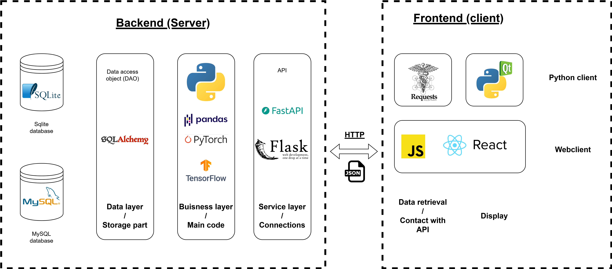

# SimpleWebClient

## Lab1 : The world of web api for big data

In this first lab, we are learning about web APIs. They are all over the place in today's datascience, and allowed a simple access for data scientist to many of big data sources, test.

The first objective of this first lab will be to create a small Python client capable to use a public API to retrieve some information online, treat it and display it in a pretty way. Buf first, what is an API and where does it insert in our architecture ?

Have a look at the graph below :

In the next part of labs, you'll learn about the part on the left of the graph, which goes from storing information in an SQL database to treating it with Python. In today's lab, we focus on the part of the middle : 

Service layer / connections and data retrieval/contact with the API.

An API, in the simplest sense of the definition could mean : an interface that an computer/application expose that can be used by another computer/application to contact it and transfer information. APi's can be line command interface, web pages in HTML, REST apis ... It is a lot of things in modern computing. 

However, in today's world, when data scientist refer to API, they have a very different vision of what it is than a computer scientist. They in fact refer to web API's. 

The criteria that data scientist use to determine if they call a service an api are : 
- does it return JSON or at least data (images included) ? 
- Is there a documentation available ?
- Can I contact it online with an HTTP protocol ? 

Basically, it can go from a [weather service](https://openweathermap.org/api) returning you the weather, to the one returning a [cat picture explaining you http codes](https://http.cat/status/404), an obviously, the [chatGPT API](https://platform.openai.com/docs/api-reference/introduction) !

But why would we use the chatGPT API if we have ... the chatGPT interface ? 

Because you're a human ! But if you are a machine, you don't care about the interface. What you want is a simple protocol to ask the question and get the answer. Especially if you are integrating a LLM like chatGPT into an application. If you want to do an autocompletion app, you will always prefer the API to the interface for example.

In the first part of this lab, explore public apis in this list :

https://github.com/public-apis/public-apis

You will select one of your choice on the following criteria :

- no authentification 
- provides text information (json or fulltext)

## Part 1 :

The first step will be to use public APIs with requests, we will build a small client capable of requesting a web service, retrieve information and display it. The second step, if you are on windows, will be to modify the PYTHONPATH variable in environment variables menu to point to the folder above the app folder. Come to my desk in case of a problem with this step.

First of all, you will rename the config_template.ini into config.ini and modify the value of API_URL to the value of your choice, according to the api you have chosen.

If you want, you can test [Insomnia](https://insomnia.rest). It is a graphical client that will help you build your own requests to the API.

You will find in this repository basic elements to contact a web API and code structure. I advise you modify it and custom make it for your API of choice.

## Part 2 :

Once you are done and your client is ok, we will learn how we can build our own API. I have made you an app you can use for that, which contains a possible solution to what we have seen in lab1. You will first check that everything related to lab 1 is ok, that you understand how the configuration and db_manager works. 

It is available here : https://github.com/profSorbus/boilerplatePython

When you understand correctly the buisness layer and the data layer of this application. You will now  have a look at what a home made api looks like. The service layer contains an example of setting up an API using FastAPI. I am not against you replacing the fastAPI part with Flask if you know what you are doing ! I won't be able to help much if you do it however.

Now, if you understand correctly my example, have read part of the documentation of fastAPI, the readme and have succesfully launched my app and visited the /docs endpoint. Feel free to start modifying this code. You will implement your own data model, or take the existing one, and implement the relative methods. 

For this work, I specially advise you not to use chatGPT or AI assisted code. It has no point : you are here to understand the layers and basics of a Python application. If you ask AI about how to code, you will likely miss key informations. However, once you have understood how applications work, and organised everything, then ChatGPT will be a magnificient tool to write the methods for you. ChatGPT is, for the moment, not the best application architect, but it sure is a great coder.